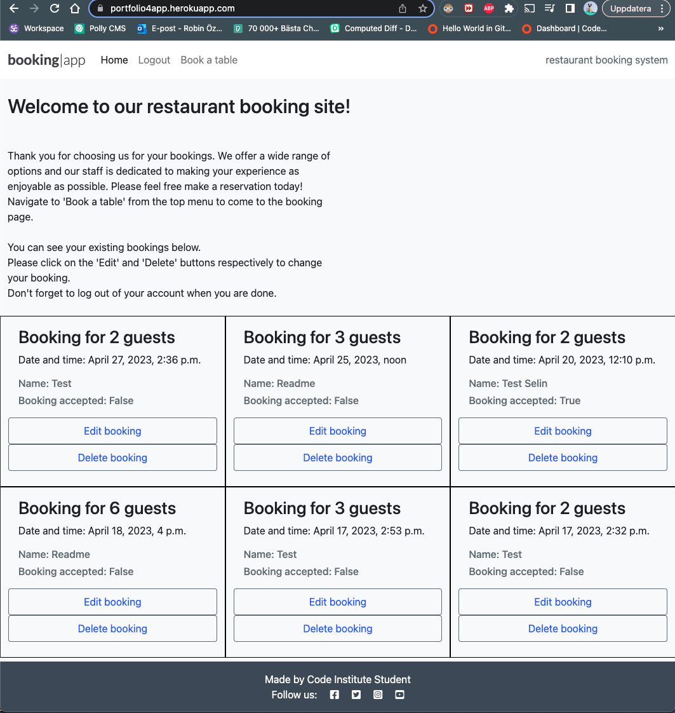
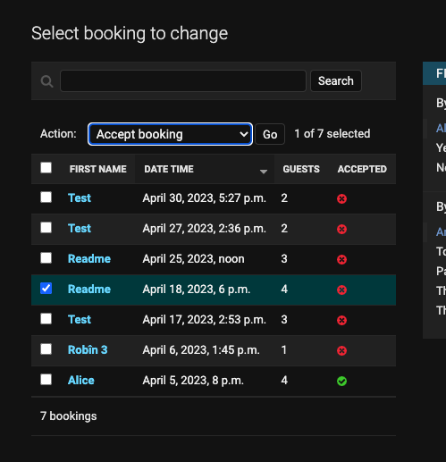

# Django Restaurant Booking System #

## Purpose of the project ##
The Restaurant Booking System is a Full-Stack web application that allows users to make reservations at a restaurant online. Users can create an account, log in, and then make, modify, or cancel a booking for a particular date and time. The application is built using Python and Django as the MVC framework, along with HTML, CSS, and JavaScript for the Front-End. The application uses a relational database (PostgreSQL) to store and manage data about users and bookings.

### External User's Goal ###
The external user's goal is to book one or more guests for a meal in a restaurant at a particular time and date.

### Site Owner's Goal ###
The site owner's goal is to take and manage online bookings for their restaurant.

## Features ##

__User Authentication and Authorization__
-   Users can create an account and log in to the system using username and password.
-   Users cannot access content belonging to a different user.
-   Users cannot access their own content without logging in to their account.

__Bookings Management__
-   Users can create a new booking for one or more guests at a particular time and date.
-   Users can modify or delete existing bookings.
-   The system prevents double bookings for the same user.

__Site navigation and main structure__
-	The website has a navigation menu clearly directing the user to each feature.
-   The design is simple and has a header, main part where bookings, instructions and forms display, and a footer at the bottom of the page.

__Form Validation__
-	Both forms (for creating a new booking and editing an existing one) raise errors when a user tries to submit form with invalid input.
-   User gets a prompt to enter valid data.

__Admin dashboard for site owners to view and manage all bookings__
-   Admin accepts bookings, turning their status to True in the UI.
-   Admin can create, view, update and delete bookings.
-   Admin can create, view, update and delete users.

## Further Features to implement ##

- The home page can display a menu, information about the restaurant, a picture, opening hours and more advanced styling to make the experience more lively.
- The system can allow for multiple table occupancies.

## Technologies Used ##
- [GitPod](https://gitpod.io/) was used to write, edit and commit the code, [GitHub](https://github.com/) for storage and version control.
- [ElephantSQL](https://www.elephantsql.com/) was used as PostgreSQL database for the project.
- [Heroku](https://www.heroku.com/) was used for deployment and testing.

## Database Model ##

There are two tables in this database model: **User** and **Booking**.

The **User** table has a one-to-many relationship to the **Booking** table. Each **Booking** is associated with exactly one **User**, but each **User** can have zero, one, or many **Bookings**. The **Booking** table has a foreign key relationship with the **User** table, meaning that each booking must belong to a user.

The **Booking** table has a field for **id** (the primary key of the table) and one for **user_id** (a foreign key that references the **id** field of the **User** table). It also has fields for **first_name**, **last_name**, **email**, **date_time**, **guests**, **special_request**, and **accepted**, all of which are specific to the **Booking** model. 

All of these fields work together to represent a single booking made by a user. The **user** field allows us to associate the booking with a specific user, while the other fields store information about the booking itself, such as the date and time, number of guests, and any special requests. The **accepted** field is a boolean field that indicates whether the booking has been accepted or not.

The **Booking** table also has a unique constraint on the combination of **date_time** and **email**, ensuring that no two bookings can be made with the same date and time, and email address.

## Agile development and User stories ##
Using principles of design thinking, the following goals were set for this project:
- Make the signup process as smooth as possible
- Make it easy for users to see and alter their bookings
- Make it easy for manager to see and manage all changes

These led to this problem statement: How do I develop a restaurant booking system that provides the functionality above to a user?

The problem statement was then used to map out the features I would need. I then created user stories corresponding to these features.
GitHub (specifically a custom user story template, issues and digital KanBan board) was used as an agile tool for creating and managing user stories, assigning them labels and tracking their progress throughout development. The board also helped with breaking down the project into sprints, keeping feature development organized (as each feature had to be created, tested and validated before moving on to the next one). Each sprint had an estimated time and estimated amount of work it would take to develop it, further helping to keep the project systematic and organized in terms of time.

The labels must haves, should haves, could have and won't have were used to determine the order of importance for the features, and which should be prioritized first. Since authentication and CRUD functionality were the main functions, these user stories were prioritized first as must-haves.

-   As a site user I can register an account so that I can log in to the system
-   As a site user I can create a new booking so that I have a table at the restaurant
-   As a site user I can view, update and delete my bookings so that I can manage my bookings
-   As a site admin I can create, view, edit and delete bookings and users so that I can manage my restaurant
-   As a site admin I can accept bookings so that I can choose which bookings to take

After these had been implemented, the following user stories were implemented as should haves, since they greatly improve the functionality of the application.
-    As a site user, I want to be restricted to making only one booking at a given time and date, so that I can avoid accidentally double-booking a table
-    As a site user, I want the fields to be pre-populated with previous information when editing a booking, so that it becomes easier for me to modify the booking details
-    As a site user, I want to be redirected to the main page when I successfully submit a booking form, so that I can see that my changes have been saved
-    As a site user, I want the system to prevent me from making bookings for past dates so that I can ensure that my bookings are valid

Could haves are listed in section 'Features to develop for better UX'.

## UX Design ##

In terms of UX design, the chart above represents the key entities and their relationships. This chart was created early on and used as a blueprint for designing a user-friendly interface that supports the key actions and workflows that users will need to perform when using the system. 

The User and Booking tables are the main entities that users will interact with, as they will use the system to manage their bookings.

The flowchart starts with the home page where the user can either register a new account or book a table. Once the user registers a new account, they can log in and create a new booking. After creating a booking, they can edit or delete it as well. After the user successfully creates, edits, or deletes a booking, they will be redirected back to the home page.

For the admin, they will have a dashboard where they can create, view, edit, and delete bookings and users. They can also accept or reject bookings from the users. After accepting or rejecting a booking, they will be redirected back to the admin dashboard.

When designing the user interface, it was important to consider how users would interact with these entities and their associated fields. For example, when creating a new booking, users will need to enter information such as their name, email, desired date and time, and number of guests. The user interface should make it clear which fields are required and provide helpful feedback if any required fields are missing or invalid.

Similarly, when viewing or updating a booking, users will need to see all of the relevant information about the booking, such as the date and time, number of guests, and any special requests. The user interface should make it easy to view and update this information, while also providing clear feedback if any changes cannot be made (e.g. if the booking is in the past or there is already a booking for that time and date).

The design is clean and simple, with neutral colors and the fonts Roboto/Lato from Google. The intention was to keep focus on the main functionalities. The section 'Features to develop for better UX' shows additional functionalities that could be added to improve the user experience further. 

## Testing ##

### Manual testing ###
I have manually tested this project by doing the following:
- Entering invalid inputs into the form (pressing Enter without any input, entering invalid numerals, entering empty space in the special requirements text field).
- Tried each feature step by step, and documented in test cases below.
- Tested the code in my local development environment as well as in the Heroku deployed app.

### Test cases ###

#### User registration ####
- User story: As a site user I can register an account so that I can log in to the system

- Testing performed: enter the URL of deployed page in browser, click Register in nav menu, enter mock details and click 'Sign Up'.

- Expected outcome: successful user registration, logs in user to platform automatically with registration.

- Result: as expected.

- Test passed.

#### Book a table ####
- User story: As a site user I can create a new booking so that I have a table at the restaurant

- Testing performed: once logged in, click 'Book a table' in nav menu and enter valid form data. Click Submit booking.

- Expected outcome: redirect user to main page where all bookings are listed, where the booking is visible (see the bottom left in screenshot for booking made in the other screenshot).

- Result: as expected.

- Test passed.

#### Edit existing booking ####
- User story: As a site user I can view, update and delete my bookings so that I can manage my bookings

- Testing performed: from the home page, click on 'Edit booking' on a given booking (I used the booking just created above). Once redirected to a form prepopulated with data from the booking, I change the time from 4pm to 6pm, and change from 6 guests to 4 guests. Click 'Submit changes'.

- Expected outcome: successful form submission, redirect user to main page where all bookings are listed, where I can see the changes applied to the updated booking.

- Result: as expected.

- Test passed.

#### Delete booking ####
- User story: As a site user I can view, update and delete my bookings so that I can manage my bookings

- Testing performed: from the home page, click on 'Delete booking' on a given booking. Once redirected to a form prepopulated with read-only data from the booking, I click 'Confirm delete'.

- Expected outcome: redirect user to main page where all bookings are listed, where I can see the booking is now deleted.

- Result: as expected.

- Test passed.

#### Admin panel for users ####
- User story: As a site admin I can create, view, edit and delete bookings and users so that I can manage my restaurant

- Testing performed: log in to the admin panel (/admin) to access main panel. Click on Users to select a User to view and change. Click on the User name to edit the details and confirm to save. Then check the box next to the name, select 'Delete selected users' and confirm to delete the user.

- Expected outcome: User updated details and then deleted from the system.

- Result: as expected.

- Test passed.

#### Admin panel for bookings ####
- User story: As a site admin I can create, view, edit and delete bookings and users so that I can manage my restaurant

- Testing performed: log in to the admin panel (/admin) to access main panel. Click on Bookings to select a Booking to view and change. Click on the name of the booking  to edit and save changes. Then check the box next to the booking, select 'Delete selected bookings' and confirm to delete.

- Expected outcome: Booking updated details and then deleted from the system.

- Result: as expected.

- Test passed.

#### Admin accepts bookings ####
- User story: As a site admin I can accept bookings so that I can choose which bookings to take

- Testing performed: log in to the admin panel (/admin) to access main panel. Click on Bookings and select a booking by checking the box next to  it, select 'Accept booking' as the action and confirm to accept. Note: when a booking is created, it automatically sets accepted as false. The admin logs in and accepts it to confirm the booking.

- Expected outcome: The booking updates to accepted.

- Result: as expected.

- Test passed.

#### Prevent double bookings ####

- User story: As a site user, I want to be restricted to making only one booking at a given time and date, so that I can avoid accidentally double-booking a table

- Testing performed: create new booking with the same email and date/time as an existing booking from the booking list. Click 'Submit booking'.

- Expected outcome: booking not accepted. Alert message prompting me to re-enter a valid option.

- Result: as expected.

- Test passed.

#### Prepopulate existing bookings ####

- User story: As a site user, I want the fields to be pre-populated with previous information when editing a booking, so that it becomes easier for me to modify the booking details

- Testing performed: from the home page click 'Edit booking' for an existing booking, and get redirected to booking edit page

- Expected outcome: on the booking edit page, the form fields are populated with the details from the booking.

- Result: as expected.

- Test passed.

#### Form date validation ####
- User story: As a site user, I want the system to prevent me from making bookings for past dates so that I can ensure that my bookings are valid

- Testing performed: fill in the booking form with valid data except for date and time: there I enter a past date, and click Submit booking.

- Expected outcome: System raise error and prompts me to re-enter a valid date set in the future.

- Result: as expected.

- Test passed.

#### Unauthorized user access ####

- Testing performed: open a link to a booking made by a user (with a unique id in the URL) while in in-cognito mode.

- Expected outcome: prevent access to the page and prompt the user to log in.

- Result: as expected.

- Test passed.

### Code validation ###
- No errors were returned when passing every .py file through the [PEP8 Python Linter](https://pep8ci.herokuapp.com/) (see screenshots for models.py and views.py in linter).
- No errors were returned when passing the CSS file through [W3C CSS Validator](https://jigsaw.w3.org/css-validator/validator)
- All pages were run through [W3C HTML Validator](https://validator.w3.org/) with no errors.

## Fixed bugs ##

I added a feature where a user is prevented from making a double booking for the same date and time as one of their other bookings. Initially I did this by adding if statements in the form_valid function for the create and edit booking views, so that an error was raised if the same user tried to double book for the same date and time. After a system crash, I deleted the if statement and went back to my model, where I added unique_together = ('date_time', 'email') into the meta class for the model. I then added an error handler directly in the template. This way, a booking made with the same e-mail address and the same date and time raises an error and prompts the user to enter another date. It is not perfect however, as a user could still use different e-mail addresses in the booking form and make more than one booking for the same time and date.

## Features to develop for better UX ##

- The feature for preventing a user from making double bookings could be developed so that the user id is used in identifying the owner of the booking, instead of email.
- Prevent bookings outside of the restaurant's opening hours: At the moment a user can request a booking at any time and date in the future, and it's up to the admin to not accept the booking if the time is not right.
- When a user submits invalid form input for a new booking, the form clears and they get a red error alert prompting them to enter valid information. For smoother UX, the old information could prepopulate the fields, meaning the user would not have to re-enter all information from scratch. This is only the case when creating new bookings, not updating old ones.
- Unfortunately due to time constraints these features could not be implemented in this project.

## Deployment ##

### Via GitPod ###
The GitHub repository was created using the Code Institute Python Essentials template:
https://github.com/Code-Institute-Org/python-essentials-template
- Click the link to get to the template. Click “Use this template”.
- Enter repository name, make the repository public and click “Create repository from template”.
- Click the green GitPod button, wait a moment for the workspace to open. All work was committed in GitPod.

- The repository can be accessed through following link: https://github.com/robinozer/PythonProject.git

### Via ElephantSQL ###
- After logging in, create new instance, give it a name and select region. Click 'Review' and Confirm new instance. Use URL in config vars in Heroku(see below) and in project env.py file.

### Via Heroku ###
Heroku was used to deploy the website. The following steps were used:
- After creating an account, create a new app and navigate to the Settings tab.
- In Config Vars, click 'Reveal Config Vars' and add config vars for secret key, database url (from ElephantSQL), Heroku PostreSQL and another with key 'PORT' and value '8000'. 
- Config var DISABLE_COLLECTSTATIC set to value of 1 was used during project development and removed in final deployment.
- In Deploy, connect to GitHub repository and deploy branch to main.

## Attaching PostgreSQL database to the project ##
In settings.py:
- Underneath 'from pathlib import Path', add the following:
import os  
import dj_database_url  
if os.path.isfile('env.py'):  
     import env
- Comment out the existing DATABASES and add the following:  
DATABASES = {'default':dj_database_url.parse(os.environ.get('DATABASE_URL'))}
- Migrate the changes.  

- The secret key variable, now secured since placed in env.py, is also added to settings.py like so:  
SECRET_KEY = os.environ.get('SECRET_KEY')

## Credits ##
- The style.css file, as well as parts of the base.html template were borrowed from CI and Matt's walkthrough project https://github.com/Code-Institute-Solutions/Django3blog
